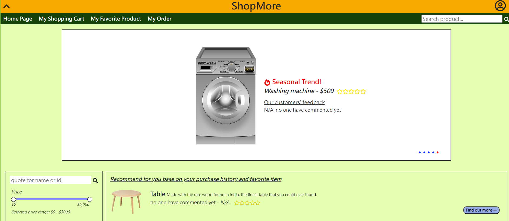

# ShopMore
Welcome to the ShopMore online shopping system! This README provides an overview of the app and code repository and guidelines to run the system properly.

# Description
ShopMore is a full-stack online shopping system that offers a comprehensive set of features for both customers and administrators. ShopMore utilizes React in frontend and Django in backend. 

ShopMore allows customers to register and authenticate themselves. After logging in, customers can browse products, add desired products to their favorite list and shopping cart, place orders, and check the order status conveniently. On the admin side, administrators can process CRUD functions of products and users on our admin page.



# Installation
**1. Install the following Python library:**
```
 pip install djangorestframework
 pip install django
 pip install django-cors-headers
 pip install pymysql
 pip install mariadb
 pip install paypalrestsdk
```

**2. Running server:**
- navigate to
  `/ShopMore`
- add the following to `__init__.py`:
```
import pymysql
pymysql.install_as_MySQLdb()
```
- input the following:
```
 python manage.py runserver
```

**3. Run client:**
- navigate to `/ShopMore/ShopMore/frontend`
- input the following:
```
npm install
npm start
```

## Enjoy the online shopping mall!
